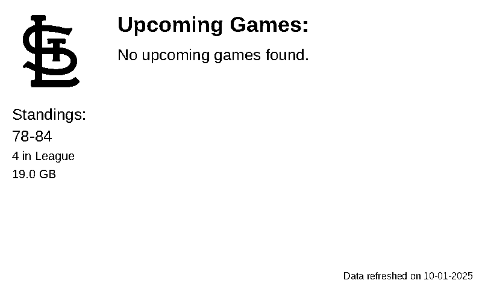

# St. Louis Cardinals Schedule Viewer for trmnl

This project fetches the St. Louis Cardinals baseball schedule and standings, then generates an image displaying this information. This image is designed to be displayed in `trmnl`.

## What is `trmnl`?

`trmnl` is a terminal display tool that can show images, including animated GIFs, and supports auto-refreshing of the displayed content. This makes it ideal for displaying dynamic information like sports schedules or dashboards directly in your terminal.

## How to Use with `trmnl`

There are two primary ways to use this project with `trmnl`:

### Method 1: Using the main repository's image (Recommended for most users)

You can directly point `trmnl` to the `trmnl_redirect.json` file within this repository. This file will always point to the latest generated schedule image.

Use the following URL with `trmnl`:

```
https://raw.githubusercontent.com/kevdog114/trmnl_stlcards/main/trmnl_redirect.json
```

### Method 2: Forking the repository for customization

If you wish to customize the image generation or other aspects of the project, you can fork this repository. `trmnl` can then be configured to use the `trmnl_redirect.json` file from your fork. This allows you to make changes and have `trmnl` display your customized version.

## Automation

This repository uses a GitHub Actions workflow that automatically:
1. Fetches the latest St. Louis Cardinals schedule and standings.
2. Generates a new image with this data.
3. Updates the `trmnl_images/cardinals_schedule.png` file.
4. Updates the `trmnl_redirect.json` to point to the newly generated image.

This ensures that the image displayed by `trmnl` is always up-to-date.

## Preview

Here is an example of the generated schedule image:


